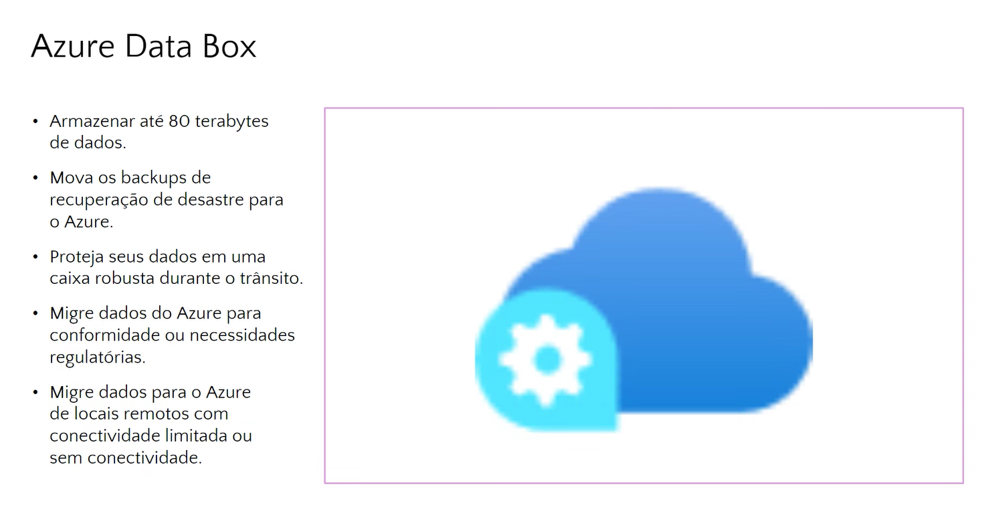

# Aula(02/12)

**Revisão**

<figure><figcaption>
*Estudar Redes*
</figcaption></figure>

<figure><figcaption></figcaption></figure>



CapEx -> Capital(Investimento Inicial)

OpEx -> Operacionais(manter funcionando) -> Energia Funcionário

_**Armazenamentos:**_



**Armazenamento em Disco na Azure:**

1. **Definição:** Armazenamento em disco refere-se ao espaço de armazenamento persistente disponível para máquinas virtuais na plataforma Azure.
2. **Propósito:** Permite que as máquinas virtuais armazenem dados de maneira durável, mesmo após desligamento ou reinicialização, sendo essencial para sistemas que exigem armazenamento de dados persistentes.
3. **Tipos:** Existem diferentes tipos de discos, incluindo discos gerenciados, discos não gerenciados e discos Premium, cada um com características específicas de desempenho e confiabilidade.

***

**Armazenamento de Blobs na Azure:**

1. **Definição:** O Azure Blob Storage é um serviço de armazenamento de objetos na nuvem, projetado para armazenar e gerenciar grandes quantidades de dados não estruturados.
2. **Propósito:** Ideal para armazenar dados como documentos, imagens, vídeos e backups, oferecendo escalabilidade e acessibilidade global.
3. **Características:** Permite o acesso por meio de HTTP/HTTPS, oferece níveis de acesso, suporta a criação de contêineres e possui classes de armazenamento que oferecem diferentes níveis de desempenho e custo.

***

**Armazenamento de Arquivos na Azure:**

1. **Definição:** O Azure File Storage fornece serviços de compartilhamento de arquivos totalmente gerenciados na nuvem, acessíveis por várias máquinas virtuais.
2. **Propósito:** Usado para armazenar e compartilhar dados entre aplicativos e máquinas virtuais, oferecendo uma solução de armazenamento compartilhado baseada em SMB (Server Message Block).
3. **Cenários de Uso:** Útil em aplicativos que requerem compartilhamento de arquivos entre várias instâncias de máquinas virtuais, como armazenamento centralizado para configurações ou conteúdos compartilhados.

***

**Resumo Geral:**

* **Armazenamento em Disco:** Focado no armazenamento persistente para máquinas virtuais, essencial para dados que precisam sobreviver a reinicializações.
* **Armazenamento de Blobs:** Destinado a grandes volumes de dados não estruturados, como documentos e mídia, com alta escalabilidade e acesso global.
* **Armazenamento de Arquivos:** Oferece serviços de compartilhamento de arquivos para aplicações que necessitam de acesso compartilhado a dados entre várias instâncias.

**Conteúdo:**

_Internet das Coisas do Azure_

_IoT é a capacidade dos dispositivos de reunir e retransmitir informações para análise de dados._

_Exemplo -> dispositivos inteligentes (Alexa, Lâmpada, Tomada, TV)_







_Recursos IoT do Azure:_

Azure IoT Central -> conectar meus dispositivos

Hub IoT Azure -> dispositivos se comunicarem apesar de marcas diferentes

Azure Sphere -> funciona como um antivírus, controla a segurança dentro da nuvem para os dispositivos ficarem mais seguros

_BigData e Análise:_



_BigData (dados - Data Warehouse) -> trabalham com dados que contém uma quantidade grande de informação_

_Essas ferramenta de BigData podem conectar dados de diversas fontes/origens_

_Análise de dados -> extrair informações úteis com base no histórico de dados_&#x20;

_Com base nos dados, é possível extrair informações que poderão ser usadas no futuro, como exemplo, ver os dados das compras e com isso, ter informações do histórico de compras e com base nisso mostrar uma propaganda com base nesse histórico..._

**Azure Big Data e Análise: Documentações**

1. **Azure Big Data:**
   * [Documentação do Azure HDInsight](https://docs.microsoft.com/azure/hdinsight/)
   * [Azure Databricks - Documentação Oficial](https://docs.microsoft.com/azure/databricks/)
2. **Azure Data Lake Storage:**
   * [Documentação do Azure Data Lake Storage](https://docs.microsoft.com/azure/storage/blobs/data-lake-storage-introduction)
3. **Azure Analytics Services:**
   * [Azure Synapse Analytics - Documentação Oficial](https://docs.microsoft.com/azure/synapse-analytics/)
   * [Azure Stream Analytics - Documentação Oficial](https://docs.microsoft.com/azure/stream-analytics/)
   * [Azure Data Factory - Documentação Oficial](https://docs.microsoft.com/azure/data-factory/)
4. **Integração e Ecossistema:**
   * [Azure Synapse Link](https://docs.microsoft.com/azure/synapse-analytics/synapse-link)
   * [Azure Logic Apps - Documentação Oficial](https://docs.microsoft.com/azure/logic-apps/)
   * [Power BI - Documentação Oficial](https://docs.microsoft.com/power-bi/)
5. **Considerações de Segurança:**
   * [Azure Active Directory - Documentação Oficial](https://docs.microsoft.com/azure/active-directory/)
   * [Azure Key Vault - Documentação Oficial](https://docs.microsoft.com/azure/key-vault/)

_Inteligência Artificial e Machine Learning:_

_(Deep Fake)_



**Machine Learning** (Aprendizado de Máquina) -> Possui modelos prontos (algoritmos) para modelar sistemas com Inteligência Artificial (Previsão de valores, busca por erros, encontrar padrões...)

**Serviços Cognitivos** ->

_Visão_ -> análise de imagens -> identificar pessoas, objetos, animais, rostos, expressões faciais, ambiente ao redor...

_Ouvir_ -> utiliza arquivos de aúdio -> transformar aúdio para texto, analisar se o texto está falando bem ou mal...

Fala -> gera voz a partir de um texto

**Serviço de Bot** -> desenvolver bots inteligentes -> chatBot

**Azure Inteligência Artificial e Machine Learning: Mini Documentação com Links**

#### **Azure AI Services:**

1. **Azure Cognitive Services:**
   * [Documentação Azure Cognitive Services](https://docs.microsoft.com/azure/cognitive-services/)
2. **Azure Machine Learning:**
   * [Documentação Azure Machine Learning](https://docs.microsoft.com/azure/machine-learning/)
3. **Azure Bot Services:**
   * [Documentação Azure Bot Services](https://docs.microsoft.com/azure/bot-service/)

**Ferramentas e Recursos:**

1. **Azure Notebooks:**
   * [Documentação Azure Notebooks](https://docs.microsoft.com/azure/notebooks/)
2. **Azure Machine Learning Studio:**
   * [Documentação Azure Machine Learning Studio](https://docs.microsoft.com/azure/machine-learning/)

**Integração e Aplicações Práticas:**

1. **Azure AI Gallery:**
   * [Documentação Azure AI Gallery](https://docs.microsoft.com/azure/ai-gallery/)
2. **Azure Machine Learning Designer:**
   * [Documentação Azure Machine Learning Designer](https://docs.microsoft.com/azure/machine-learning/designer/)

**Casos de Uso e Tutoriais:**

1. **Azure AI Customer Stories:**
   * [Azure AI Customer Stories](https://customers.microsoft.com/en-us/ai)
2. **Azure Machine Learning Samples:**
   * [Azure Machine Learning Samples](https://github.com/Azure/azureml-samples)

**Considerações de Ética e Explicabilidade:**

1. **Azure AI Responsible AI Toolkit:**
   * [Documentação Azure AI Responsible AI Toolkit](https://docs.microsoft.com/azure/machine-learning/responsible-ai)

**Computação sem Servidor:**

**Computação sem Servidor ->** Permite executar códigos sem a necessidade de configurar a infraestrutura (IaaS) e, com isso, ficam mais baratos (pago por acesso).

**Aplicativos Lógicos ->** Integração de aplicativos com padrões diferentes que precisam trocar dados.

**O que é Computação Sem Servidor:**&#x20;

* A computação sem servidor é um modelo de desenvolvimento de aplicativos em que os desenvolvedores podem se concentrar apenas na lógica de negócios do código, sem se preocupar com a infraestrutura subjacente, como servidores, redes ou sistemas operacionais. Nesse modelo, as funções ou serviços executam unidades de trabalho individuais em resposta a eventos específicos, escalando automaticamente conforme necessário.

#### **Links para Documentação:**

1. **Azure Functions:**
   * [Azure Functions Documentation](https://docs.microsoft.com/azure/azure-functions/)
2. **Azure Logic Apps:**
   * [Azure Logic Apps Documentation](https://docs.microsoft.com/azure/logic-apps/)
3. **Azure Event Grid:**
   * [Azure Event Grid Documentation](https://docs.microsoft.com/azure/event-grid/)
4. **Azure Static Web Apps:**
   * [Azure Static Web Apps Documentation](https://docs.microsoft.com/azure/static-web-apps/)
5. **Triggers e bindings do Azure Cosmos DB (Integração com Azure Functions):**
   * [Triggers e bindings do Azure Cosmos DB](https://docs.microsoft.com/azure/azure-functions/functions-bindings-cosmosdb-v2)
6. **Azure Managed Identity:**
   * [Azure Managed Identity Documentation](https://docs.microsoft.com/azure/azure-resource-manager/managed-identities-overview)
7. **Azure Functions Quickstart:**
   * [Azure Functions Quickstart](https://docs.microsoft.com/azure/azure-functions/functions-create-first-function-vs-code)
8. **Azure Logic Apps Tutorial:**
   * [Azure Logic Apps Tutorial](https://docs.microsoft.com/azure/logic-apps/quickstart-create-first-logic-app-workflow)

**Desenvolver aplicativos com DevOps e GitHub:**

Devops -> configura a infraestrutura que dará suporte aos recursos

GitHub -> controla as versões dos códigos que foram desenvolvidos

GitHub Actions -> automatização de tarefas de teste e implantação

Labs -> criar ambientes para verificar o funcionamento do aplicativo

**Desenvolvimento de Aplicativos com DevOps e GitHub no Azure, incluindo Azure DevTest Labs: Links para Documentação**

#### **O que é DevOps no Azure:**

* DevOps no Azure é uma abordagem de desenvolvimento e operações que enfatiza a colaboração e comunicação contínuas entre desenvolvedores e operadores. Ele visa automatizar processos de construção, teste e implementação, facilitando a entrega rápida e confiável de software. Utilizando serviços e ferramentas no Azure, o DevOps permite a integração contínua (CI), entrega contínua (CD) e automação de infraestrutura.

#### **Azure DevOps:**

1. **Azure DevOps Services:**
   * [Documentação do Azure DevOps Services](https://docs.microsoft.com/azure/devops/)
2. **Azure DevOps Repos:**
   * [Documentação do Azure DevOps Repos](https://docs.microsoft.com/azure/devops/repos/)
3. **Azure DevOps Pipelines:**
   * [Documentação do Azure DevOps Pipelines](https://docs.microsoft.com/azure/devops/pipelines/)
4. **Azure DevOps Artifacts:**
   * [Documentação do Azure DevOps Artifacts](https://docs.microsoft.com/azure/devops/artifacts/)

#### **GitHub no Azure:**

5. **GitHub Actions com Azure:**
   * [Documentação sobre GitHub Actions e Azure](https://docs.github.com/en/actions/guides/deploying-to-azure)
6. **Azure Repos no GitHub:**
   * [Documentação sobre Azure Repos no GitHub](https://docs.microsoft.com/azure/devops/repos/github/)
7. **GitHub Actions para Azure Kubernetes Service (AKS):**
   * [Tutorial de Integração do GitHub Actions com AKS](https://docs.microsoft.com/azure/aks/github-actions)

#### **Integração Contínua e Entrega Contínua (CI/CD):**

8. **Azure DevOps CI/CD com GitHub:**
   * [Tutorial de Integração Contínua com GitHub Actions e Azure DevOps](https://docs.microsoft.com/azure/devops/pipelines/repos/github)
9. **Azure DevOps Service Connections:**
   * [Configurando Service Connections para Azure no Azure DevOps](https://docs.microsoft.com/azure/devops/pipelines/library/service-endpoints)

#### **Azure DevTest Labs:**

10. **Azure DevTest Labs:**
    * [Documentação do Azure DevTest Labs](https://docs.microsoft.com/azure/lab-services/devtest-lab-overview)
11. **Azure DevTest Labs com GitHub Actions:**
    * [Integração do Azure DevTest Labs com GitHub Actions](https://docs.microsoft.com/azure/lab-services/devtest-lab-github-actions-integration)

#### **Recursos Adicionais:**

12. **Azure DevOps Labs:**
    * [Azure DevOps Labs para Tutoriais e Exemplos](https://www.azuredevopslabs.com/)
13. **GitHub Learning Lab:**
    * [GitHub Learning Lab para treinamentos interativos](https://lab.github.com/)
14. **Azure DevOps YouTube Channel:**
    * [Canal do Azure DevOps no YouTube](https://www.youtube.com/channel/UCrhJmfAGQ5K81XQ8\_od1iTg)

**Ferramentas de Gerenciamento do Azure:**&#x20;

#### **1. Portal do Azure:**

* **Funcionalidade:** Interface web intuitiva para gerenciamento e monitoramento de recursos no Azure.
* **Uso:** [Portal do Azure](https://portal.azure.com/)

#### **2. Azure PowerShell e CLI:**

* **Funcionalidade:** Conjunto de ferramentas de linha de comando para automação e gerenciamento de recursos no Azure.
* **Uso (PowerShell):** [Azure PowerShell](https://docs.microsoft.com/azure/powershell/)
* **Uso (CLI):** [Azure CLI](https://docs.microsoft.com/azure/cli/)

#### **3. Cloud Shell:**

* **Funcionalidade:** Ambiente de shell interativo baseado na nuvem para execução de comandos do Azure.
* **Uso:** [Azure Cloud Shell](https://docs.microsoft.com/azure/cloud-shell/)

#### **4. Aplicativo Móvel do Azure:**

* **Funcionalidade:** Acesso móvel para monitorar e gerenciar recursos do Azure em dispositivos móveis.
* **Uso:** [Aplicativo Móvel do Azure](https://azure.microsoft.com/services/app-service/mobile/)

#### **5. Assistente do Azure:**

* **Funcionalidade:** Guia passo a passo para criar e configurar recursos no Azure, simplificando o processo para iniciantes.
* **Uso:** [Assistente do Azure](https://docs.microsoft.com/azure/guidance/guidance-azure-assistant)

#### **6. Modelos do Azure Resource Manager (ARM):**

* **Funcionalidade:** Infraestrutura como código (IaC) para implantação consistente e gerenciamento de recursos no Azure.
* **Uso:** [Modelos ARM](https://docs.microsoft.com/azure/azure-resource-manager/)

#### **7. Azure Monitor:**

* **Funcionalidade:** Oferece insights sobre o desempenho e a integridade dos recursos, permitindo ação proativa.
* **Uso:** [Azure Monitor](https://docs.microsoft.com/azure/azure-monitor/)

#### **8. Integridade do Serviço do Azure (Azure Service Health):**

* **Funcionalidade:** Fornece informações em tempo real sobre o status operacional dos serviços do Azure.
* **Uso:** [Integridade do Serviço do Azure](https://status.azure.com/)

<figure><figcaption></figcaption></figure>





**Assistente do Azure:**

#### **Funcionalidade:**

O Assistente do Azure é uma ferramenta projetada para orientar usuários no processo de criação e configuração de recursos no Azure. Ele oferece uma abordagem guiada, passo a passo, para simplificar tarefas e projetos específicos, proporcionando uma experiência mais amigável, especialmente para iniciantes.

#### **Uso:**

* **Documentação Oficial:** [Assistente do Azure](https://docs.microsoft.com/azure/guidance/guidance-azure-assistant)

#### **Principais Características:**

1. **Guias Interativos:** Fornece guias interativos para criar e configurar recursos com instruções claras e práticas.
2. **Recomendações Personalizadas:** Oferece sugestões personalizadas com base nas necessidades e intenções do usuário.
3. **Validação em Tempo Real:** Realiza validações em tempo real para garantir a conformidade e evitar erros.
4. **Aprendizado Orientado:** Serve como uma ferramenta educacional, capacitando os usuários a compreenderem melhor os serviços do Azure.
5. **Suporte a Múltiplas Plataformas:** Pode ser utilizado através do Portal do Azure, Visual Studio Code e outros ambientes.

#### **Benefícios:**

* **Facilidade de Uso:** Reduz a curva de aprendizado para iniciantes no Azure.
* **Agilidade:** Acelera o processo de criação de recursos por meio de orientações passo a passo.
* **Conformidade:** Ajuda a garantir a implementação correta e a conformidade com as práticas recomendadas.
* **Educação Continuada:** Serve como uma ferramenta educacional que promove a aprendizagem contínua.

**Azure Monitor:**&#x20;

\-> Analisa em tempo real os recursos criados

\-> Desempenho dos recursos

\-> Cria um histórico de registros com tudo o que ocorreu  com aquele recurso

\-> Criar alerta e notificações

#### **Funcionalidade:**

O Azure Monitor é um serviço abrangente de monitoramento na nuvem da Microsoft, projetado para fornecer insights sobre o desempenho, integridade e disponibilidade de aplicativos e infraestrutura hospedados no Azure. Ele agrega dados de vários serviços do Azure e de recursos locais, oferecendo uma visão unificada e avançada do ambiente.

#### **Uso:**

* **Documentação Oficial:** [Azure Monitor](https://docs.microsoft.com/azure/azure-monitor/)

#### **Principais Recursos:**

1. **Logs do Azure Monitor:**
   * _Funcionalidade:_ Armazena e analisa logs para fornecer insights detalhados sobre operações e eventos.
   * _Uso:_ [Logs do Azure Monitor](https://docs.microsoft.com/azure/azure-monitor/)
2. **Métricas do Azure:**
   * _Funcionalidade:_ Coleta métricas em tempo real para avaliar o desempenho e a utilização dos recursos.
   * _Uso:_ [Métricas do Azure](https://docs.microsoft.com/azure/azure-monitor/)
3. **Aplicação Insights:**
   * _Funcionalidade:_ Fornecimento de insights para aplicativos, incluindo rastreamento de solicitações, exceções e dependências.
   * _Uso:_ [Azure Application Insights](https://docs.microsoft.com/azure/azure-monitor/)
4. **Alertas e Ações Automáticas:**
   * _Funcionalidade:_ Configuração de alertas para notificações proativas e automação de ações em resposta a eventos específicos.
   * _Uso:_ [Alertas no Azure Monitor](https://docs.microsoft.com/azure/azure-monitor/)
5. **Network Watcher:**
   * _Funcionalidade:_ Oferece insights detalhados sobre o tráfego de rede e a conectividade.
   * _Uso:_ [Network Watcher](https://docs.microsoft.com/azure/network-watcher/)
6. **Monitoramento Híbrido:**
   * _Funcionalidade:_ Extende a capacidade de monitoramento para ambientes locais e em outras nuvens.
   * _Uso:_ [Monitoramento Híbrido](https://docs.microsoft.com/azure/azure-monitor/)

#### **Benefícios:**

* **Visibilidade Unificada:** Oferece uma visão centralizada e abrangente do ambiente do Azure.
* **Resolução Proativa de Problemas:** Permite a identificação antecipada de problemas e a tomada de medidas antes que impactem os usuários.
* **Otimização de Desempenho:** Ajuda a otimizar o desempenho dos aplicativos e recursos da nuvem.
* **Tomada de Decisões Informed:** Fornece dados e insights críticos para apoiar decisões informadas sobre operações e escalabilidade.

<figure><figcaption></figcaption></figure>

**Modelos do Azure Resource Manager (ARM):**

#### **Funcionalidade:**

Os Modelos do Azure Resource Manager (ARM) são artefatos de infraestrutura como código (IaC) que descrevem os recursos do Azure a serem implantados e configurados. Eles oferecem uma maneira declarativa de definir a infraestrutura, permitindo a criação consistente, repetível e controlada por código.

#### **Uso:**

* **Documentação Oficial:** [Modelos do Azure Resource Manager](https://docs.microsoft.com/azure/azure-resource-manager/)

#### **Principais Características:**

1. **Declarativo e Legível:** Os modelos são escritos de maneira declarativa, descrevendo o estado desejado da infraestrutura, tornando-os legíveis e compreensíveis.
2. **Reutilização:** Os modelos podem ser reutilizados em diferentes ambientes e para diferentes finalidades, promovendo a consistência e eficiência.
3. **Versionamento e Controle de Alterações:** O versionamento integrado permite rastrear alterações ao longo do tempo, facilitando o controle de versões e auditoria.
4. **Suporte a Parâmetros e Variáveis:** Permite a parametrização de valores e a definição de variáveis para flexibilidade e personalização.
5. **Extensibilidade:** Suporte a extensões e scripts personalizados para aprimorar a configuração e personalização.
6. **Compatibilidade com Diversos Recursos:** Pode ser usado para provisionar uma ampla variedade de recursos no Azure, como VMs, redes, bancos de dados e muito mais.

#### **Benefícios:**

* **Consistência:** Garante a consistência na criação e gerenciamento de recursos, eliminando discrepâncias entre ambientes.
* **Eficiência:** Permite a implantação rápida e eficiente de infraestrutura, reduzindo o tempo de configuração manual.
* **Auditoria e Rastreamento:** Facilita a auditoria, rastreamento de alterações e reversão para versões anteriores.
* **Padronização:** Promove práticas de padronização e governança na gestão de recursos.
* **Colaboração:** Facilita a colaboração entre equipes de desenvolvimento e operações, integrando IaC no ciclo de vida do desenvolvimento.
